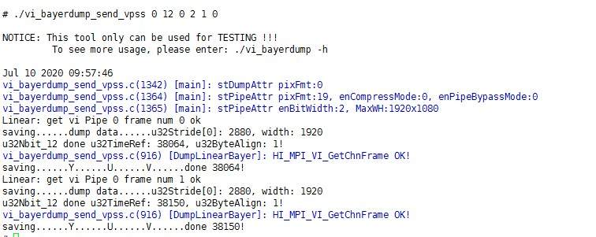
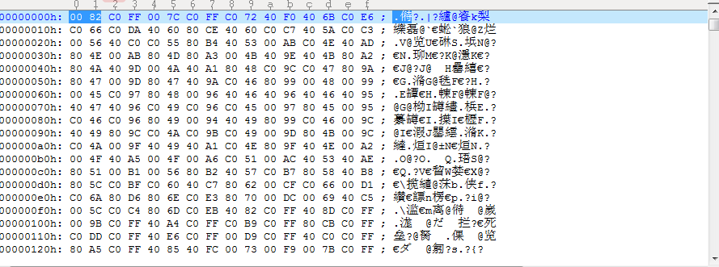
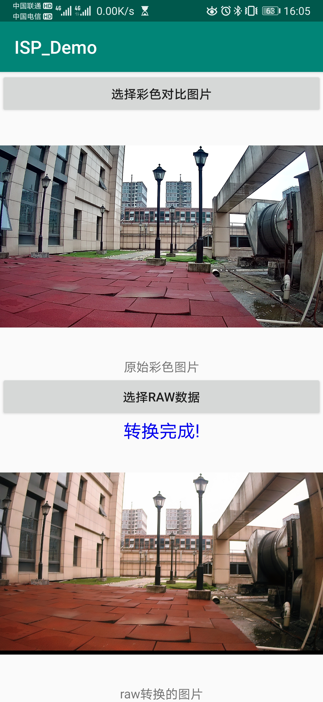

## **isp_AutoISP**
本项目实现将 _raw_ 数据转换成 _rgb_ 图像的功能，整个项目从数据采集开始，到安卓手机端部署 *demo* 结束。具体过程如下：

### **一、数据采集和处理**
本项目使用的数据是一对 _raw_ 数据和 _rgb_ 图像，在采集时是采集的一帧 _raw_ 数据及其对应的一帧 _yuv_ 数据，后续会将 _yuv_ 数据转成 _rgb_ 图像。整个数据的采集和处理流程是：

#### 1、采集 _raw_ 数据和 _yuv_ 数据
本项目目前使用的数据都是通过海思 _BLK16EV12-0307-38X38-B V1.01_ 型号的 _sensor_ 获取的，主要是使用 _vi_bayerdump_send_vpss_ 工具来采集 _raw_ 数据和对应的 _yuv_ 数据。
##### 工具说明：
        从 VIPipe 获取一帧 raw 后保存到文件后，送给 VIPipe，再送给 VPSS，最后从 VPSSChn 获取 yuv 数据。
##### 使用说明：
        Usage: ./vi_bayerdump_send_vpss [ViPipe] [nbit] [Compress] [FrmCnt] [ByteAlign] [RatioShow]
        ViPipe: 
                0:ViPipe0 ~ 3:ViPipe 3
        nbit: 
                The bit num to be dump
        Compress: 
                Whether to  dump compressed raw, default is 0
        FrmCnt: 
                the count of frame to be dump
        ByteAlign: 
                Whether convert to Byte align, default is 1
        RatioShow: 
                Whether the file name of raw show ratio info, default is 0
##### 使用示例：
        ./vi_bayerdump_send_vpss 0 12 0 2 1 0

##### 注意：如果第一次失败可以再运行一次

##### 采集指令运行成功后的样图：

#### 2、_raw_ 数据处理
本项目使用的 _sensor_ 输出的 _raw_ 数据的顺序是 _RG/GB_，所以在处理 _raw_ 数据是要先将其转换成 _R_ 、_Gr_ 、 _Gb_ 、 _B_ 四个通道的数据。具体代码实现在`./tools/tools.py`中的 `oneimg2npy_()` 函数中。 
* 首先，以读取二进制文件的方式读取 _raw_ 数据，注意 _raw_ 数据是 16 位的，有效位是 12 位。并且以二进制文件的方式读取 _raw_ 数据后是每两个字节表示一个像素值，同时根据分辨率大小可知一个 _raw_ 数据具有 1080 * 1920 * 2 个字节数；
* 其次，_raw_ 数据每两个字节表示一个像素值，一个字节是八位，而我们的 _raw_ 数据有效位是 12 位（对应像素值的范围就是 0 ~ 4095)，所以这两个字节的低 4 位全都是 0 需要抛弃掉。用 *UltraEdit* 软件打开一个 _raw_ 数据，如下图。

用 _a1 a2_，_a3 a4_，表示两个字节，如上图中选中的两个字节（*a1, a3* 代表每个字节的高四位，_a2, a4_ 代表每个字节的低四位），可以发现所有的 _a2_ 位置的值全为 0，所以在将 _raw_ 数据以二进制方式读取后将十六进制数转换为像素值时十六进制数的顺序是 _a3 a4 a1_ ，则具体实现：
        
        bayer = np.zeros(shape=2073600, dtype='uint16')
        file_path = os.path.join(root_dir, case, file)

        with open(file_path, "rb") as f:
            for i in range(0, len(f.read()), 2):
                f.seek(i)
                raw = f.read(2)
                a1 = int((raw[0] / 16) % 16)
                a2 = int(raw[0] % 16)
                a3 = int((raw[1] / 16) % 16)
                a4 = int(raw[1] % 16)
                value = a3 * 256 + a4 * 16 + a1 * 1
                bayer[int(i / 2)] = value

        bayer = bayer.reshape(1080, 1920)
    
* 最后，按照 _raw_ 数据 _RG/GB_ 的顺序将 _raw_ 数据转换成 _R, Gr, Gb, B_ 四个通道的数组。以读取二进制文件的方式读取一个 _raw_ 数据并将其值的十六进制数转换为像素值后，我们可以将这些像素值按照转换时的顺序一一存进一个大小为 _1080 * 1920_ 的 _Uint16_ 数组中。根据 _raw_ 数据的顺序，则该数组的第一行是 1920 个代表 _R, GR_ 的像素值，并且顺序是 [_R, Gr, R, Gr, ..., R, Gr_]；第二行是 1920 个代表 _Gb, B_ 的像素值，其顺序为 [_Gb, B, Gb, B, ..., Gb, B_]；第三行和第一行一样的表示和顺序；第四行和第二行也是一样的表示和顺序；第五行则和第一行及第三行一样，下面的以此类推。根据这样的表示和顺序可以从 _1080 * 1920_ 大小的数组中抽取出 4 个分别只表示 _R, Gr, Gb, B_ ，大小为 540 * 960 的数组，在将这 4 个数组 stack 到一起得到一个大小为 540 * 960 的 4 通道的数组，其 _shape_ 为 (4， 540， 960)。体代码实现在`./tools/tools.py`中的 `yuv2bgr()` 函数中。

        height, width = bayer.shape[0], bayer.shape[1]
        # print(height, width)
        h = height // 2
        w = width // 2

        R = np.zeros(shape=(h, w), dtype='uint16', order='C')
        Gr = np.zeros(shape=(h, w), dtype='uint16', order='C')
        Gb = np.zeros(shape=(h, w), dtype='uint16', order='C')
        B = np.zeros(shape=(h, w), dtype='uint16', order='C')

        for x in range(height):
            for y in range(0, width, 2):
                if x % 2 == 0:
                    R[int(x / 2)][int(y / 2)] = bayer[x][y]
                    Gr[int(x / 2)][int(y / 2)] = bayer[x][y + 1]
                elif x % 2 == 1:
                    Gb[int(x / 2)][int(y / 2)] = bayer[x][y]
                    B[int(x / 2)][int(y / 2)] = bayer[x][y + 1]

        out = np.stack((R, Gr, Gb, B))

#### 2、_yuv_ 数据处理
_raw_ 数据转换为 (4, 540, 960) 的数组后才能作为模型的输入，而本项目的目的是将 _raw_ 数据转换为 _rgb_ 图像。所以我们需要将每一帧 _raw_ 数据对应的 _yuv_ 转换为 _rgb_ 图像，这样便于训练模型时的数据读取。转换 _yuv_ 数据到 _rgb_ 图像后，分辨率为 1080 * 1920。

##### **建议**：_raw_ 数据和 _yuv_ 数据的转换非常耗时，可以提前将需要用来训练和测试的数据转换好。同时，由于 _raw_ 数据转换后是 4 通道的 _npy_ 数据，建议在将 _yuv_ 数据转成 _rgb_ 图像后也存成 _npy_ 数组，这样便于在 _DataSet_ 中统一处理。有关 _raw_ 数据和 _yuv_ 数据的处理代码在 `./tools/tools.py` 中，具体过程可以在代码中看到。 

### **二、模型训练与测试**

#### 1、模型训练，在命令端输入下面命令开始训练
训练可以使用一些技巧，不同的技巧只要设置对应的参数即可实现。如，要使用蒸馏的话只要在传参时添加参数`--teacher True`即可（不过前提需要训练好一个 _teacher model_ 才行），要使用混合精度训练的话添加参数`--apex True`即可，要使用半精度训练的话添加参数`--half True`。 

    python3 train.py --crop-size 64 --outtype Unet_SR --channel 32 --model-path ./model/Unet_SR --batch-size 16 --nb-epochs 2000 --learning-rate 1e-4
* ##### 注意：训练的数据我是通过读取 _txt_ 文件中的路径获得的，需要的话可以使用`./tools/img2txt.py`中的 `npy2txt()`函数根据自己的数据的路径将这些数据路径存进 _txt_ 文件中，

#### 2、模型测试：
    python3 test.py
* ##### 注意：修改 `test.py` 中需要测试数据、模型最优权重，结果保存的三个路径。

### **三、安卓部署 _Demo_**

#### 1、_pytorch_ 模型转 _onnx_，再将 _onnx_ 转换为 _TNN_ 的 _.tnnmodel_ 和 _.tnnproto_ 两个文件使用 _TNN_ 进行安卓部署。
* ##### 注意： _pytorch_ 模型中使用插值(UpSampling层)时，尽量不要使用双线性或双三次等插值方式，因为使用这些插值方式会要求设置参数`align_corners=True`。而设置这个参数后，在使用`torch.onnx._export()`将 _pytorch_ 模型转为 _onnx_ 时会被要求设置一个有关 _onnx_ 版本的参数`opset_version=11`。可是得到这个版本的 _onnx_ 是不被 _TNN_ 所支持的，会导致无法转换 _onnx_ 模型到 _TNN_ 模型。 
* #### 四通道转换选择在模型中完成，即将 _pytorch_ 模型改成单通道输入，然后在模型中将单通道输入的数据转换成四通道。代码实现就是在 _pytorch_ 模型中添加一个 `self.pack()`函数，该函数在将 _pytorch_ 模型转成 _onnx_ 模型时打开。

#### 2、以二进制文件的方式打开 _raw_ 文件并处理好高低位后转成 float 数据送入 _TNN_ 的 _input_mat_ 中进行前向推理。
* ##### 注意： _TNN_ 的 _input_mat_ 的数据类型是 `NCHW_FLOAT`， _output_mat_ 的数据类型是`N8UC3`。

#### 3、推理的结果转成 _bitmap_，最后在手机屏幕上显示出来。

